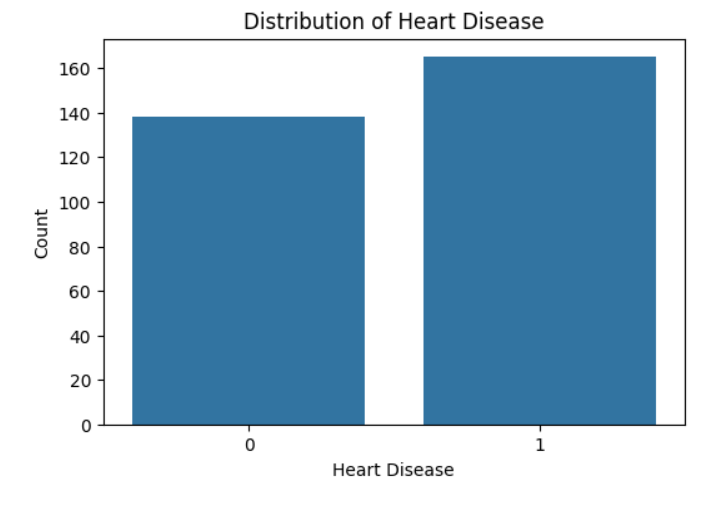
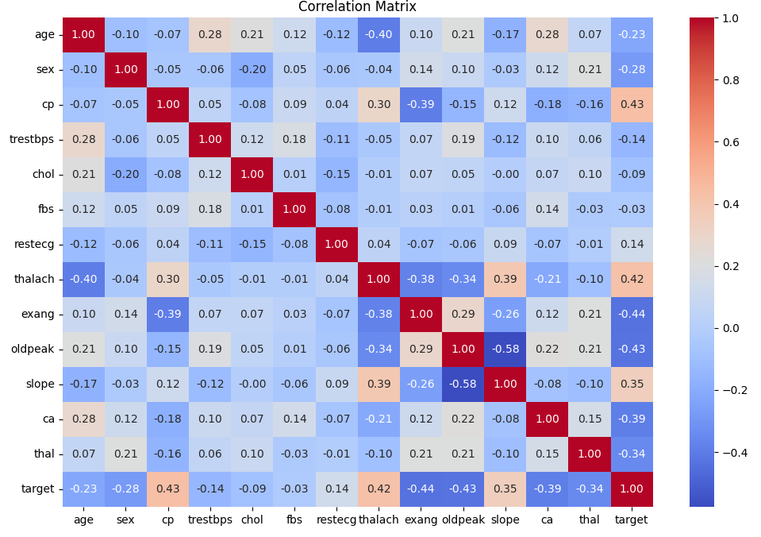

#  Heart Disease Prediction using Machine Learning

## Project Overview

This project predicts whether a patient has heart disease using Machine Learning algorithms based on medical attributes. The objective is to compare different classification algorithms and identify the model that provides the best prediction performance.

---

##  Objectives

- Predict heart disease using patient medical data.
- Perform data preprocessing and exploratory data analysis.
- Train multiple Machine Learning models.
- Compare model performance using evaluation metrics.
- Select the best-performing model.

---

##  Dataset

**Dataset:** UCI Heart Disease Dataset

Features include:

- Age
- Sex
- Chest Pain Type
- Resting Blood Pressure
- Cholesterol
- Fasting Blood Sugar
- Resting ECG
- Maximum Heart Rate
- Exercise Induced Angina
- Oldpeak
- Slope
- Number of Major Vessels
- Thalassemia

Target Variable:

- **0 → No Heart Disease**
- **1 → Heart Disease**

---

##  Technologies Used

- Python
- Jupyter Notebook
- Pandas
- NumPy
- Matplotlib
- Seaborn
- Scikit-learn
- Joblib

---

##  Workflow

1. Data Collection
2. Data Preprocessing
3. Exploratory Data Analysis
4. Train-Test Split
5. Feature Scaling
6. Logistic Regression
7. Random Forest
8. Cross Validation
9. ROC-AUC Analysis
10. Model Comparison

---

##  Machine Learning Models

- Logistic Regression
- Random Forest Classifier

---

## Model Performance

| Model | Accuracy | Precision | Recall | F1 Score | ROC-AUC |
|--------|---------:|----------:|--------:|---------:|--------:|
| Logistic Regression | 85% | 87% | 84% | 86% | 0.93 |
| Random Forest | 84% | 84% | 84% | 84% | 0.92 |

---

##  Project Structure

```text
Task-1/

├── data/
│   └── heart.csv

├── images/
│   ├── target_distribution.png
│   ├── correlation_heatmap.png
│   ├── roc_comparison.png
│   ├── confusion_matrix_logistic.png
│   └── confusion_matrix_random_forest.png

├── models/
│   ├── logistic_regression.pkl
│   └── random_forest.pkl

├── notebooks/
│   └── Heart_Disease_Prediction.ipynb

├── reports/
│   └── Task1_Heart_Disease_Prediction_Report.pdf

├── README.md
├── project_documentation.md
└── requirements.txt
```

---

## Evaluation Metrics

The models were evaluated using:

- Accuracy
- Precision
- Recall
- F1 Score
- Confusion Matrix
- Cross Validation
- ROC-AUC Score

---

##  Best Model

Logistic Regression achieved the highest performance with:

- Accuracy: 85%
- Precision: 87%
- Recall: 84%
- F1 Score: 86%
- ROC-AUC: 0.93

---

##  Future Improvements

- Train on a larger dataset.
- Perform hyperparameter tuning.
- Deploy using Flask or Streamlit.
- Build a web interface for prediction.

---

##  References

- UCI Machine Learning Repository
- Scikit-learn Documentation
- Pandas Documentation
- NumPy Documentation

---

##  Project Screenshots

### Target Distribution



---

### Correlation Heatmap



---

### ROC Curve Comparison


